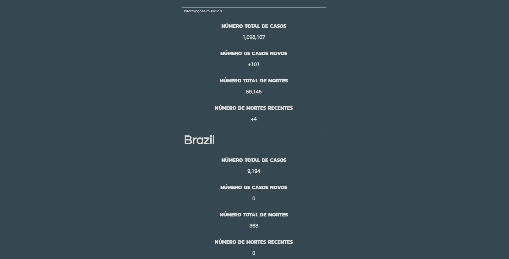

<h1 align="center">Corona status web</h1>
<p align="center">Web page to show the data from COVID-19 API that i made</p>

<p align="center">


</p>

<br/>

# COVID-19 in time

<p align="center">
  
</p>

Is a web page created with reactjs and the mainly intent of this page is show a example to how use COVID-19 API, thats another repo of my repository list.
This example is hosted at `heroku` if you dont want to download and execute in your machine.  

> **Heroku address:**  https://corona-status-web.herokuapp.com/

# Setup

To install all dependencies, go to project directory and run:

```
  yarn install
```

Now run the project:

```
  yarn start
```

<br/>

---

<br/>

<p align="center">If this repository helped you, please consider give a star.</p>
<p align="center">
  By <a href="https://github.com/the0wl">the_0wl</a>
</p>